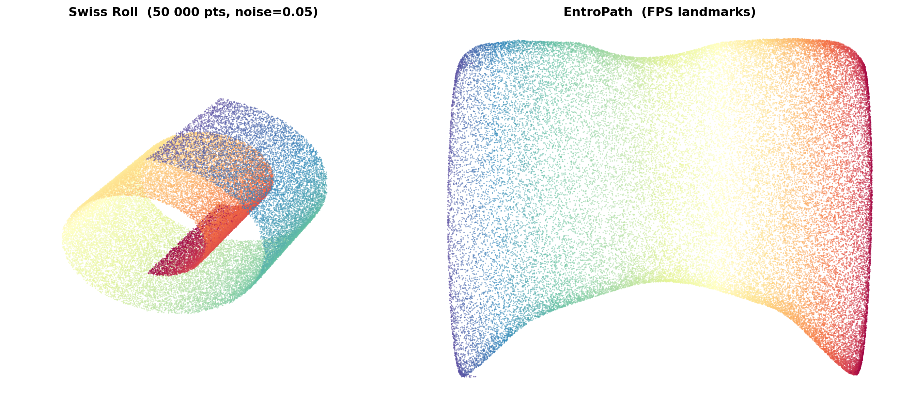
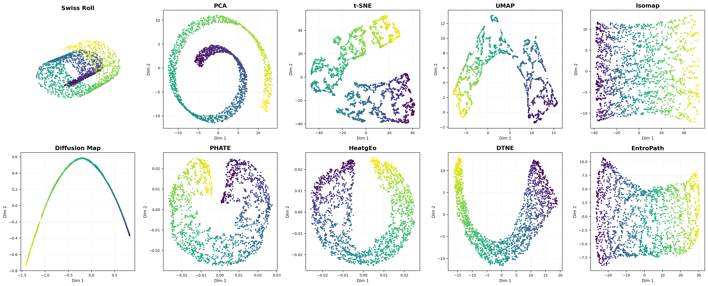

# EntroPath

**Official implementation of:**

> Rola, P. *EntroPath: Maximum Entropy Path Ensemble Embedding for Manifold Learning.* arXiv preprint (2026).

EntroPath is a manifold learning algorithm that combines the **Maximum Entropy Random Walk (MERW)** with **diffusion geometry** to produce geometrically faithful low-dimensional embeddings of high-dimensional data. It scales to large datasets via **landmark-based acceleration** (k-means or FPS).

> **Want to reproduce the paper's results?** Jump to [Reproducing the paper's results](#reproducing-the-papers-results). Every figure, table, and ablation can be regenerated from the notebooks in [`notebooks/`](notebooks) and [`experiments/ablation/`](experiments/ablation).

## Installation

### Use the library

Clone the repository and install in editable mode. This pulls the core dependencies (numpy, scipy, scikit-learn, phate) declared in `pyproject.toml`:

```bash
git clone https://github.com/rpprzemek/entropath.git
cd entropath
pip install -e .
```

The library itself has no dependency on DTNE or HeatGeo — those are only needed to run the benchmark notebooks (see below).

### Reproduce the paper

Reproducing the figures and tables needs the benchmark stack at the **exact versions** the paper was run with. Results are sensitive to the RNG stream (seeded via `numpy.random.RandomState`) and to library internals that consume it, which can change across releases — so install the pinned lockfile:

```bash
pip install -r requirements.txt
```

This installs cleanly on Linux, macOS, and Windows and covers **EntroPath, the synthetic benchmarks, the ablations, the PyPI baselines (PHATE, UMAP, Diffusion Maps, …), the evaluation metrics, and the single-cell results.** Verify the environment before running:

```bash
python -c "import entropath; print('environment OK')"
```

The benchmark notebooks additionally require **DTNE** and **HeatGeo** — see the next section.

### DTNE and HeatGeo baselines (required to run the benchmark notebooks)

The benchmark notebooks compare EntroPath against DTNE and HeatGeo and **import both at module load** (via `utils/benchmark_utils.py` and `utils/bio_utils.py`), so **both must be installed for the benchmark notebooks to run** — a benchmark comparison without its main competitors would not be meaningful. The EntroPath library itself does not depend on them.

Neither installs cleanly from its upstream repository on a modern toolchain, so each needs a small manual packaging fix. These fixes touch **packaging only**, not the methods, so the baselines behave identically to their upstream versions.

**DTNE** ([statway/DTNE](https://github.com/statway/DTNE)) — upstream declares no package set, so setuptools can't build it. Clone it, add the following to its `pyproject.toml`, then `pip install .`:

```toml
[tool.setuptools.packages.find]
include = ["dtne*"]
```

**HeatGeo** ([KrishnaswamyLab/HeatGeo](https://github.com/KrishnaswamyLab/HeatGeo)) — trickier. Its `setup.py` imports the removed `pkg_resources.parse_version`; clone it and replace that line with `from packaging.version import parse as parse_version`, then install with `--no-deps` (its metadata pins `numpy 1.23` / `scikit-learn 1.2`, which would downgrade and break the stack above). HeatGeo also pulls the compiled `s_gd2` extension, which is architecture-specific — no Linux/Python 3.11 wheel, and a known pain on Apple Silicon — so a reliable cross-platform path is still being finalized.

Reference environment: Python 3.11. See `requirements.txt` for exact package versions.

## Quick Start

```python
from entropath import EntroPath

model = EntroPath(k_neighbors=15, n_components=2)
Y = model.fit_transform(X)
```

## Scalable embedding with landmarks

For large datasets, EntroPath builds the affinity graph and runs MDS only on a subset of landmark points, then projects the remaining points onto the landmark embedding. This reduces memory and compute while preserving the global geometry. Landmark acceleration is enabled automatically when $N > 2000$; you can also control it explicitly via `use_landmarks`. Two landmark strategies are available via `landmarks_method`: `"kmeans"` (used in the paper) and `"fps"` (Farthest Point Sampling).

```python
model = EntroPath(
    k_neighbors=15,
    kernel="gaussian",       # alpha_decay used for bio/single-cell (synthetic uses "gaussian")
    use_landmarks=True,
    landmarks_method="kmeans",   # or "fps"
    n_landmarks=2000,
    k_project=50,
    mds_solver="smacof",
    random_state=42,
)
Y = model.fit_transform(X)
```

Example — EntroPath with landmarks:



## Algorithm

Given a dataset $X \in \mathbb{R}^{N \times d}$, neighbor count $k_\text{NN}$, embedding dimension $d_\text{emb}$, and maximum depth $t_\text{max}$:

**Step 1 — Build affinity graph**

Compute local bandwidths $\sigma_i$ (the $k_\text{NN}$-nearest-neighbor distance of $x_i$) and form an adaptive kernel on the $k_\text{NN}$ graph:

$$A_{ij} = \exp\!\left(-\frac{\|x_i - x_j\|^2}{\sigma_i \sigma_j}\right), \qquad A \leftarrow \max(A, A^\top)$$

(shown for the Gaussian kernel; see [Features](#features) for the alpha-decay and Cauchy variants).

**Step 2 — MERW operator**

Compute the Perron eigenpair $(\lambda_{\max}, \psi)$ of $A$ and define the Maximum Entropy Random Walk (MERW) transition matrix together with its symmetric conjugate:

$$T_{ij} = \frac{A_{ij}}{\lambda_{\max}}\frac{\psi_j}{\psi_i}, \qquad \tilde{A} = \frac{A}{\lambda_{\max}}$$

$T$ is stochastic; $\tilde{A}$ is symmetric and similar to $T$.

**Step 3 — Adaptive diffusion depth**

Select the diffusion time $k$ as the knee of the von Neumann entropy curve of $T^t$:

$$k = \arg\text{knee}\bigl\{\mathcal{S}_\text{vN}(T^t)\bigr\}_{t=1}^{t_{\max}}$$

This follows the von Neumann entropy knee criterion used by PHATE, here applied to the MERW operator.

**Step 4 — Free-energy dissimilarity**

Raise $\tilde{A}$ to the $k$-th power and convert to a dissimilarity via the negative log:

$$\tilde{A}^k = \textsc{MatrixPower}(\tilde{A},\, k), \qquad D_{ij} = -\log(\tilde{A}^k)_{ij}, \quad D_{ii} = 0$$

By Varadhan's lemma, $D$ approximates the **squared** geodesic distance on the manifold (up to the $4k/\lambda_{\max}$ prefactor). $D$ is a *dissimilarity*, not a metric — the triangle inequality is not guaranteed.

**Step 5 — Embed**

Treat $D$ as a squared-dissimilarity matrix: form the classical-MDS solution by double-centering $D$ (yielding the Gram matrix) and taking its leading $d_\text{emb}$ eigenvectors, then refine with metric MDS (SMACOF) initialized at that solution to obtain the final embedding $Y \in \mathbb{R}^{N \times d_\text{emb}}$.

## Reproducing the paper's results

Every figure and table in the paper can be regenerated using the notebooks in [`notebooks/`](notebooks). The method configuration is centralized per suite — `get_methods()` in [`utils/benchmark_utils.py`](utils/benchmark_utils.py) for the synthetic and clustering experiments, and `get_bio_methods()` in [`utils/bio_utils.py`](utils/bio_utils.py) for the single-cell experiments. The notebooks import these rather than re-specifying hyperparameters, so all experiments in a suite share one recipe.

**1. Set up the environment**

```bash
pip install -e .
pip install -r requirements.txt
```

This covers EntroPath, the synthetic benchmarks, the ablations, the PyPI baselines, the metrics, and the single-cell results. The benchmark notebooks also import **DTNE** and **HeatGeo** at load time, so install [those baselines](#dtne-and-heatgeo-baselines-required-to-run-the-benchmark-notebooks) before running any benchmark notebook — otherwise the `utils` import will fail.

**2. EntroPath configuration**

These settings are shared across all experiments:

| Setting              | Value          |
| -------------------- | -------------- |
| `k_neighbors`        | 15             |
| `landmarks_method`   | `"kmeans"`     |
| `n_landmarks`        | 2000           |
| `k_project`          | 50             |
| `mds_solver`         | `"smacof"` (initialized at classical MDS) |

The **kernel** differs by experiment: `"gaussian"` (the default) for the synthetic benchmarks, and `"alpha_decay"` with `decay=40` for the clustering and bio/single-cell experiments. `alpha_decay` is the recommended kernel for biological data.

Full-rank embeddings are used for $N \le 2000$; landmark acceleration is enabled automatically for larger datasets ($N > 2000$). Diffusion depth $k$ is selected automatically per dataset (Step 3).

**3. Run the notebooks**

```bash
jupyter lab notebooks/
```

Each notebook writes numeric results to `results/` and figures (PDF + PNG) to `figures/`, in a subfolder tagged by the experiment so runs never overwrite each other.

| Paper item                                                        | Notebook / folder                                                                 |
| ----------------------------------------------------------------- | --------------------------------------------------------------------------------- |
| Synthetic manifold benchmarks (Swiss roll, sphere, torus, hole, trees) | [`notebooks/synthetic/`](notebooks/synthetic)                                |
| Non-uniform Swiss roll (Beta(1,4))                                | [`notebooks/synthetic/03_non_uniform_swiss_roll_analytic.ipynb`](notebooks/synthetic/03_non_uniform_swiss_roll_analytic.ipynb) |
| Single-cell / bio (Paul15, Nestorowa, Pancreas, Lymphoid, EB, Root Atlas) | [`notebooks/bio/`](notebooks/bio)                                         |
| Clustering benchmark (Tree / PBMC / MNIST)                        | [`notebooks/clustering/clustering_benchmark.ipynb`](notebooks/clustering/clustering_benchmark.ipynb) |
| MNIST visual comparison (illustrative)                            | [`notebooks/mnist/mnist.ipynb`](notebooks/mnist/mnist.ipynb)                       |
| Ablation studies                                                  | [`experiments/ablation/`](experiments/ablation) (see its README)                  |

Some datasets are not redistributed and must be downloaded first — see [`data/README.md`](data/README.md) for sources and placement (e.g. the embryoid-body file `EBT_counts_sqrt.h5ad` from the DTNE Google Drive).

> **Determinism note.** Reproducing the published numbers exactly relies on the package versions in `requirements.txt`. Newer releases of the core numerical libraries can change random-number streams, so the same seeds may give slightly different results on an unpinned environment.

## Examples

**Swiss Roll** (2000 points, noise = 0.05) — EntroPath vs. standard dimensionality-reduction methods:



**Biological data** embeddings:


## Features

- **MERW transition dynamics** — the maximum entropy random walk explores the manifold with uniform path statistics, unlike the degree-biased walk of standard diffusion maps.
- **Adaptive affinity kernels** — choose between `"gaussian"` (general purpose), `"alpha_decay"` (paper default for single-cell data; an adaptive-bandwidth kernel whose tail sharpness is set by `decay` — at `decay=40` it is *sharper and lighter-tailed* than a Gaussian), or `"cauchy"` (heavy-tailed, robust to outliers).
- **Automatic diffusion depth** — the von Neumann entropy knee selects $k$ data-adaptively; no manual tuning required.
- **Free-energy dissimilarity** — $D_{ij} = -\log(\tilde{A}^k)_{ij}$ provides a principled, geodesic-like dissimilarity on the manifold (approximating squared geodesic distance).
- **Landmark acceleration** — k-means or FPS landmarks make the algorithm practical for large $N$ ($10^4$–$10^5$ points).
- **scikit-learn-compatible API** — `fit`, `fit_transform`.

For the full list of parameters and options, see the docstring (`help(EntroPath)`).

## Citation

If you use EntroPath in your research, please cite:

```bibtex
@misc{rola2026entropath,
  title  = {EntroPath: Maximum Entropy Path Ensemble Embedding for Manifold Learning},
  author = {Rola, Przemys{\l}aw},
  year   = {2026},
  eprint = {2607.06497},
  archivePrefix = {arXiv},
  primaryClass = {cs.LG},
  url    = {https://arxiv.org/abs/2607.06497},
}
```

## License

Released under the [MIT License](LICENSE).
